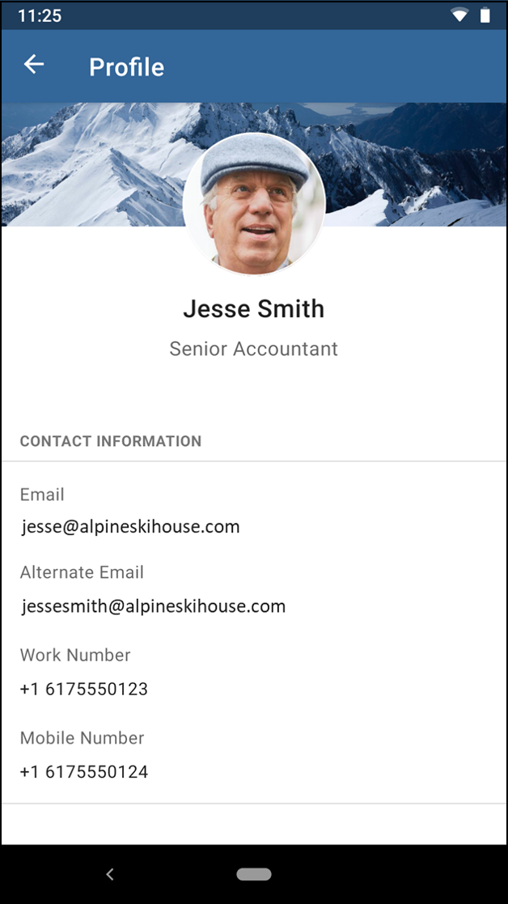

## TheForkChallenge

Neige just got out of school. He read a lot about clean architecture & android.  
He just created this POC based on this [dummy api](https://dummyapi.io/docs).  
To run this draft project you have to create your own app-id and change it in `UserService.kt`

He started to create 4 modules :

- A well known `:app` module
- Two features module `search` and `user`.
- The `api` module.

**But he needs your help to improve his skill**

#### Tips
- To help him, **you can add dependencies** you think he would need.
- You **should improve the architecture** where you think it's necessary.
- To share what you have done you **must create a Git Repository**, and send him the link.

### 1st - Architecture:

Can you give him feedback on the architecture of his project ?  
You should point out the good things and the issues you found (at least 3 of each).

**Good things :**
- The project is small
- It's modularized
- The app module doesn't contain the main activity

**Issues :**
- Some kotlin dependencies were deprecated or not included, not allowing the parcelable data class behaviour.
- Some layouts weren't using ConstraintLayout element
- ...
- ...
- ...

### 2nd - Unit tests:

He never did any test, and he’s stuck with his `SearchPresenter`.  
Help him improve that class so that it’s testable and write the tests for him.

### 3rd - New activity implementation:

Now, you must help him finish the app by 
- coding the `UserActivity.kt`
- plugging it to the `SearchActivity.kt` (you can use his navigation function`navigateToUser`).  
Don't hesitate to apply the advices you gave him in question #1

Here is a screenshot of the target he would like to reach

Don't forget to look at the [API](https://dummyapi.io/explorer) 
If you feel brave you can also try to use [Compose](https://developer.android.com/jetpack/compose) for the view.

### 4th - Navigation:

As you can see, `UserActivity.kt` is opened using reflection. What are the drawbacks of that solution ?  
Neige would like to improve the navigation but he doesn't want to create a dependency between `search` & `user`.
Do you understand why ?

Could you suggest a solution and even implement it ?